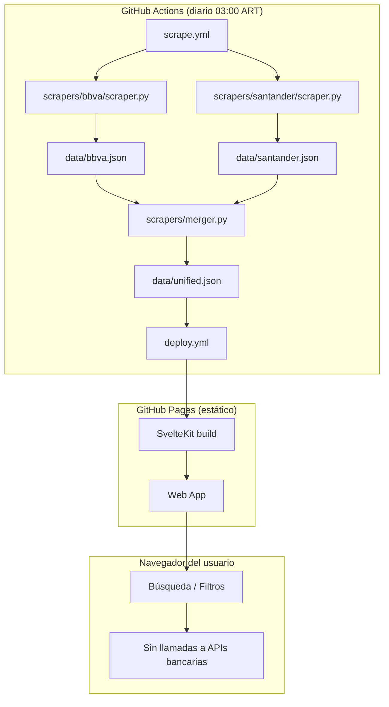

# Discount Tracker Argentina


Búsqueda unificada de descuentos y promociones vigentes de **BBVA** y **Santander Argentina**. Los datos se actualizan automáticamente una vez por día sin requerir interacción del usuario con portales bancarios.

---

## Arquitectura



---

## Inicio Rápido (Desarrollo Local)

### Pre-requisitos

- Python 3.12+
- Node.js 20+

### 1. Instalar dependencias de scrapers

```bash
pip install -r scrapers/requirements.txt
```

### 2. Ejecutar scrapers manualmente

```bash
python -m scrapers.bbva.scraper --output data/bbva.json
python -m scrapers.santander.scraper --output data/santander.json
python -m scrapers.merger --bbva data/bbva.json --santander data/santander.json --output data/unified.json
```

### 3. Iniciar la web app en modo dev

```bash
cd web
npm install
cp -r ../data/ static/data/
npm run dev
```

La app estará disponible en `http://localhost:5173`.

---

## Actualización de Datos (GitHub Actions)

El workflow `scrape.yml` se ejecuta diariamente a las **06:00 UTC (03:00 ART)**:

1. Ejecuta los scrapers de BBVA y Santander.
2. Fusiona y normaliza los datos en `data/unified.json`.
3. Commitea los archivos JSON actualizados al repositorio.
4. Dispara el workflow `deploy.yml` para reconstruir y redesplegar la app.

Si el scraper falla en un día, el JSON de la ejecución anterior permanece en el repo (degradación controlada). El frontend muestra una alerta si los datos tienen más de 25 horas de antigüedad.

Para disparar manualmente desde la UI de GitHub: **Actions → Daily Scrape → Run workflow**.

---

## Ejecutar Tests

```bash
pip install -r tests/requirements-test.txt
pytest tests/ -v
```

Los tests están diseñados para ejecutarse **sin conexión de red** (todos los HTTP calls están mockeados). Los tests de scrapers se saltean automáticamente (`pytest.skip`) si la implementación del módulo correspondiente no existe aún.

---

## Documentación

- [DESIGN.md](DESIGN.md) — Documento de diseño completo: taxonomía, schema, workflows, fases, riesgos.
